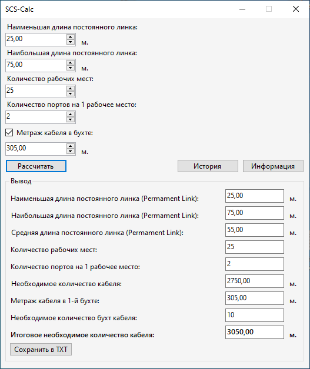
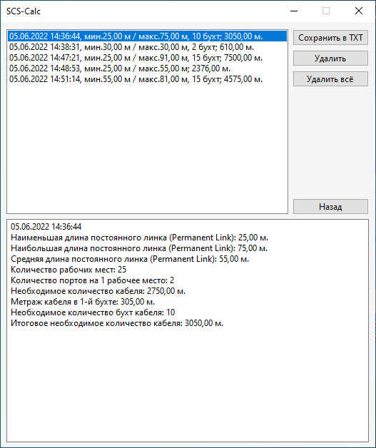
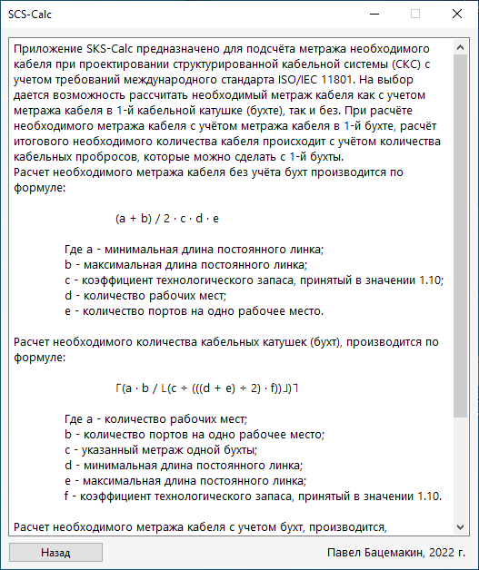

# SKS-Calc
SKS-Calc - приложение, предназначенное для подсчёта метража необходимого кабеля при проектировании структурированной кабельной системы (СКС) с учетом требований международного стандарта ISO/IEC 11801.  
Язык: C# 
Платформа: Windows Forms, .NET 6 
Целевая ОС: Windows 
Дата релиза: 05.06.2022  
  
  

